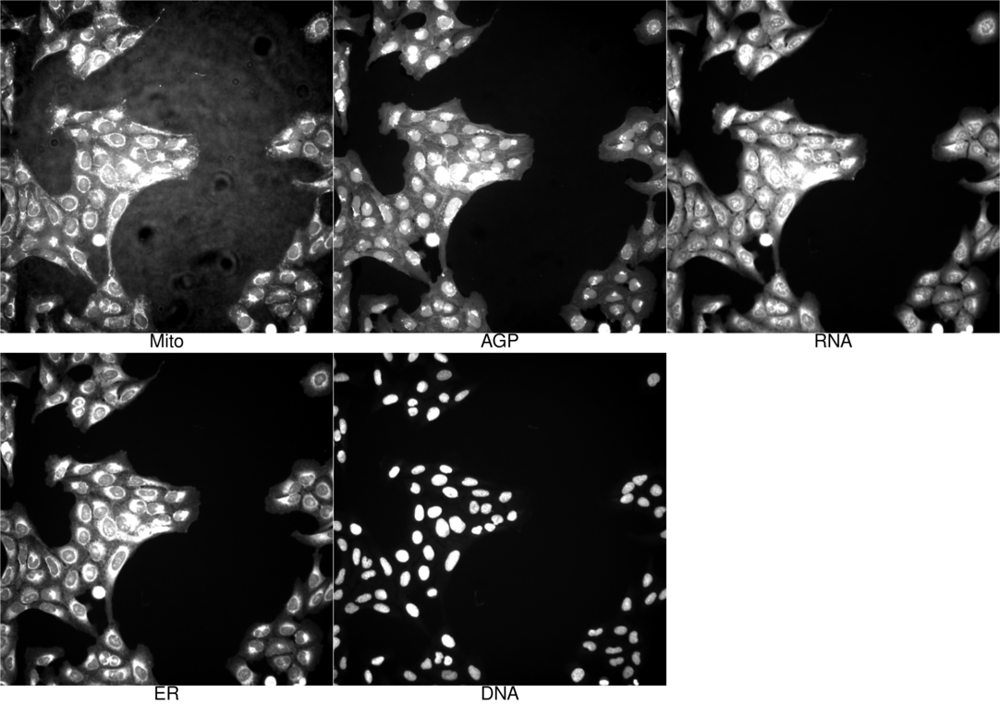
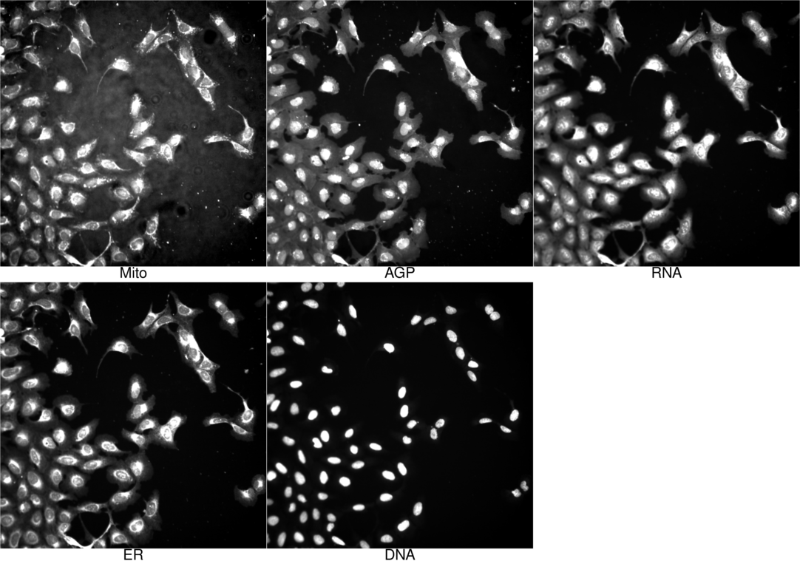
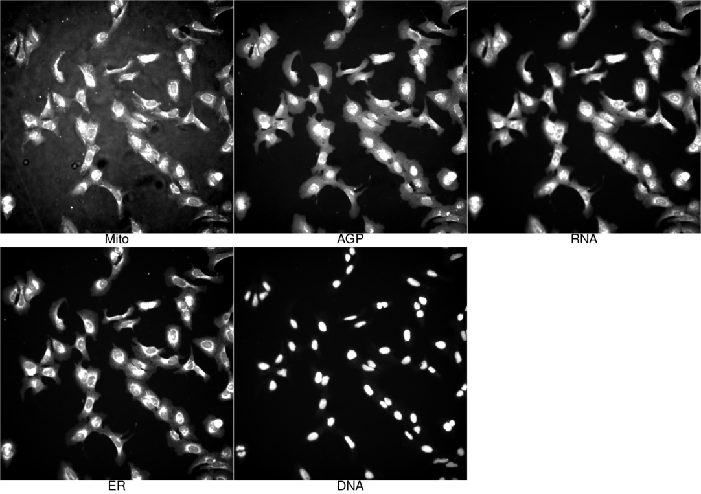

Display images demo
================

-   [Setup](#setup)
-   [Display images](#display-images)
    -   [`Standard__Compound__U2OS__24__BRD-K36660044-001-24-2`](#standard__compound__u2os__24__brd-k36660044-001-24-2)
    -   [`Standard__Compound__U2OS__24__BRD-K67637637-003-11-8`](#standard__compound__u2os__24__brd-k67637637-003-11-8)
    -   [`Standard__Compound__U2OS__24__BRD-K24616672-003-20-1`](#standard__compound__u2os__24__brd-k24616672-003-20-1)
    -   [`Standard__Compound__U2OS__24__BRD-K61688984-001-02-9`](#standard__compound__u2os__24__brd-k61688984-001-02-9)
    -   [`Standard__Compound__U2OS__24__BRD-K93632104-001-17-2`](#standard__compound__u2os__24__brd-k93632104-001-17-2)
    -   [`Standard__CRISPR__U2OS__144__BRDN0001146959`](#standard__crispr__u2os__144__brdn0001146959)
    -   [`Standard__CRISPR__U2OS__144__BRDN0000585461`](#standard__crispr__u2os__144__brdn0000585461)
    -   [`Standard__CRISPR__U2OS__144__BRDN0001483257`](#standard__crispr__u2os__144__brdn0001483257)
    -   [`Standard__CRISPR__U2OS__144__BRDN0001480092`](#standard__crispr__u2os__144__brdn0001480092)
    -   [`Standard__CRISPR__U2OS__144__BRDN0001054815`](#standard__crispr__u2os__144__brdn0001054815)
    -   [`Standard__ORF__U2OS__48__ccsbBroad304_14597`](#standard__orf__u2os__48__ccsbbroad304_14597)
    -   [`Standard__ORF__U2OS__48__ccsbBroad304_00733`](#standard__orf__u2os__48__ccsbbroad304_00733)
    -   [`Standard__ORF__U2OS__48__ccsbBroad304_06412`](#standard__orf__u2os__48__ccsbbroad304_06412)
    -   [`Standard__ORF__U2OS__48__ccsbBroad304_07535`](#standard__orf__u2os__48__ccsbbroad304_07535)
    -   [`Standard__ORF__U2OS__48__ccsbBroad304_16173`](#standard__orf__u2os__48__ccsbbroad304_16173)

# Setup

``` r
library(magrittr)
library(tidyverse)
library(glue)
library(arrow)
```

``` r
batch <- params$batch
futile.logger::flog.info(glue("Batch = {batch}"))
```

    ## INFO [2021-05-15 08:26:49] Batch = 2020_11_04_CPJUMP1

``` r
data_path <- params$data_path
git_commit_hash <- system(glue::glue("cd {data_path}; git rev-parse HEAD; cd .."), intern = TRUE)
print(glue::glue("Git commit of {data_path} = {git_commit_hash}"))
```

    ## Git commit of ../../pilot-cpjump1-data = b1c56a51ab2ff4eda5414b7e031dd8f9bd81c588

``` r
git_remote <- system(glue::glue("cd {data_path}; git remote -v; cd .."), intern = TRUE)
print(glue::glue("Git remote of {data_path} = {git_remote}"))
```

    ## Git remote of ../../pilot-cpjump1-data = origin  git@github.com:jump-cellpainting/pilot-cpjump1-data.git (fetch)
    ## Git remote of ../../pilot-cpjump1-data = origin  git@github.com:jump-cellpainting/pilot-cpjump1-data.git (push)

# Display images

``` r
display_images <- function(query, lut, n_samples = 2) {
  for (i in seq(nrow(query))) {
    # get i'th query
    query_i <- slice(query, i)
    
    # get corresponding lookup row
    lut_query <-
      inner_join(lut, query_i)
#      inner_join(lut, query_i, by = intersect(names(lut), names(query)))
    
    # get tag for query
    query_tag <- paste0(query_i, collapse = "__")
    
    cat('\n\n## `', query_tag, '`\n\n')
    
    # number of replicates to display
    # NOTE: This can have unexpected output because the rows of `lut_query` may
    # not really be replicates. E.g. if we specify only `Metadata_broad_sample`
    # in a compound experiment that has multiple doses, `lut_query` will have
    # all wells of `Metadata_broad_sample` at all dose points.
    # TODO: Figure out how to handle this.
    
    n_samples <- min(n_samples, nrow(lut_query))
    
    for (j in seq(n_samples)) {
      lut_query_j <- slice(lut_query, j)
      
      lut_query_tag <- paste0(lut_query_j, collapse = "__")
      
      Metadata_thumbnail_path_j <-
        lut_query_j$Metadata_thumbnail_path
      
      image_code = glue("\n\n\n\n")
      
      cat(image_code)
      
      cat(
        lut_query_j %>%
          select(-Metadata_thumbnail_path) %>%
          mutate(across(everything(), as.character)) %>%
          pivot_longer(everything()) %>%
          format_tsv() %>%
          str_replace_all("\n", "\n\n")
      )
      
    }
    
  }
  
}
```

``` r
lut_files <-
  glue("{data_path}/visualize/{batch}/{batch}_.*_lut.csv")
```

``` r
lut <-
  list.files(dirname(lut_files), full.names = T, pattern = basename(lut_files)) %>%
  map_df(read_csv, col_types = cols()) %>%
  mutate(Metadata_thumbnail_path = 
           file.path(data_path, Metadata_thumbnail_path))
```

``` r
experiment <-
  data.frame(
    Metadata_experiment_condition = "Standard",
    Metadata_experiment_type = "Compound",
    Metadata_cell_line = "U2OS",
    Metadata_timepoint = 24
  )

query <- tribble(
  ~ Metadata_broad_sample,
  "BRD-K36660044-001-24-2",
  "BRD-K67637637-003-11-8",
  "BRD-K24616672-003-20-1",
  "BRD-K61688984-001-02-9",
  "BRD-K93632104-001-17-2"
)

query <- bind_cols(experiment, query)

display_images(query, lut)
```

    ## Joining, by = c("Metadata_broad_sample", "Metadata_cell_line", "Metadata_timepoint", "Metadata_experiment_type", "Metadata_experiment_condition")

## `Standard__Compound__U2OS__24__BRD-K36660044-001-24-2`


name value

Metadata\_Batch 2020\_11\_04\_CPJUMP1

Metadata\_Plate BR00116995

Metadata\_Well F17

Metadata\_Site 1

Metadata\_FieldID 1

Metadata\_Row 6

Metadata\_Col 17

Metadata\_plate\_map\_name C-7210-01-CMP-013

Metadata\_broad\_sample BRD-K36660044-001-24-2

Metadata\_genes NA

Metadata\_pert\_type trt

Metadata\_control\_type NA

Metadata\_Assay\_Plate\_Barcode BR00116995

Metadata\_Plate\_Map\_Name C-7210-01-CMP-013

Metadata\_cell\_line U2OS

Metadata\_timepoint 24

Metadata\_experiment\_type Compound

Metadata\_experiment\_condition Standard

Metadata\_replicate\_id 1

Metadata\_negcon\_control\_type NA

Metadata\_target\_sequence NA

Metadata\_mg\_per\_ml 1.1163

Metadata\_mmoles\_per\_liter 5

Metadata\_solvent DMSO

Metadata\_target HDAC6

Metadata\_pert\_iname bufexamac

Metadata\_pubchem\_cid 2466

Metadata\_InChIKey MXJWRABVEGLYDG-UHFFFAOYSA-N

Metadata\_gene NA

Metadata\_negcon\_or\_other pert

Metadata\_negcon\_control\_type\_trimmed NA

Metadata\_WellCode r06c17

Metadata\_cachedir image\_cache

Metadata\_montagedir montage


name value

Metadata\_Batch 2020\_11\_04\_CPJUMP1

Metadata\_Plate BR00117024

Metadata\_Well F17

Metadata\_Site 1

Metadata\_FieldID 1

Metadata\_Row 6

Metadata\_Col 17

Metadata\_plate\_map\_name C-7210-01-CMP-013

Metadata\_broad\_sample BRD-K36660044-001-24-2

Metadata\_genes NA

Metadata\_pert\_type trt

Metadata\_control\_type NA

Metadata\_Assay\_Plate\_Barcode BR00117024

Metadata\_Plate\_Map\_Name C-7210-01-CMP-013

Metadata\_cell\_line U2OS

Metadata\_timepoint 24

Metadata\_experiment\_type Compound

Metadata\_experiment\_condition Standard

Metadata\_replicate\_id 2

Metadata\_negcon\_control\_type NA

Metadata\_target\_sequence NA

Metadata\_mg\_per\_ml 1.1163

Metadata\_mmoles\_per\_liter 5

Metadata\_solvent DMSO

Metadata\_target HDAC6

Metadata\_pert\_iname bufexamac

Metadata\_pubchem\_cid 2466

Metadata\_InChIKey MXJWRABVEGLYDG-UHFFFAOYSA-N

Metadata\_gene NA

Metadata\_negcon\_or\_other pert

Metadata\_negcon\_control\_type\_trimmed NA

Metadata\_WellCode r06c17

Metadata\_cachedir image\_cache

Metadata\_montagedir montage

    ## Joining, by = c("Metadata_broad_sample", "Metadata_cell_line", "Metadata_timepoint", "Metadata_experiment_type", "Metadata_experiment_condition")

## `Standard__Compound__U2OS__24__BRD-K67637637-003-11-8`


name value

Metadata\_Batch 2020\_11\_04\_CPJUMP1

Metadata\_Plate BR00117024

Metadata\_Well M03

Metadata\_Site 1

Metadata\_FieldID 1

Metadata\_Row 13

Metadata\_Col 3

Metadata\_plate\_map\_name C-7210-01-CMP-013

Metadata\_broad\_sample BRD-K67637637-003-11-8

Metadata\_genes NA

Metadata\_pert\_type trt

Metadata\_control\_type NA

Metadata\_Assay\_Plate\_Barcode BR00117024

Metadata\_Plate\_Map\_Name C-7210-01-CMP-013

Metadata\_cell\_line U2OS

Metadata\_timepoint 24

Metadata\_experiment\_type Compound

Metadata\_experiment\_condition Standard

Metadata\_replicate\_id 2

Metadata\_negcon\_control\_type NA

Metadata\_target\_sequence NA

Metadata\_mg\_per\_ml 1.8694

Metadata\_mmoles\_per\_liter 5

Metadata\_solvent DMSO

Metadata\_target S100B

Metadata\_pert\_iname olopatadine

Metadata\_pubchem\_cid 25271818

Metadata\_InChIKey JBIMVDZLSHOPLA-LSCVHKIXSA-N

Metadata\_gene NA

Metadata\_negcon\_or\_other pert

Metadata\_negcon\_control\_type\_trimmed NA

Metadata\_WellCode r13c03

Metadata\_cachedir image\_cache

Metadata\_montagedir montage


name value

Metadata\_Batch 2020\_11\_04\_CPJUMP1

Metadata\_Plate BR00117025

Metadata\_Well M03

Metadata\_Site 1

Metadata\_FieldID 1

Metadata\_Row 13

Metadata\_Col 3

Metadata\_plate\_map\_name C-7210-01-CMP-013

Metadata\_broad\_sample BRD-K67637637-003-11-8

Metadata\_genes NA

Metadata\_pert\_type trt

Metadata\_control\_type NA

Metadata\_Assay\_Plate\_Barcode BR00117025

Metadata\_Plate\_Map\_Name C-7210-01-CMP-013

Metadata\_cell\_line U2OS

Metadata\_timepoint 24

Metadata\_experiment\_type Compound

Metadata\_experiment\_condition Standard

Metadata\_replicate\_id 3

Metadata\_negcon\_control\_type NA

Metadata\_target\_sequence NA

Metadata\_mg\_per\_ml 1.8694

Metadata\_mmoles\_per\_liter 5

Metadata\_solvent DMSO

Metadata\_target S100B

Metadata\_pert\_iname olopatadine

Metadata\_pubchem\_cid 25271818

Metadata\_InChIKey JBIMVDZLSHOPLA-LSCVHKIXSA-N

Metadata\_gene NA

Metadata\_negcon\_or\_other pert

Metadata\_negcon\_control\_type\_trimmed NA

Metadata\_WellCode r13c03

Metadata\_cachedir image\_cache

Metadata\_montagedir montage

    ## Joining, by = c("Metadata_broad_sample", "Metadata_cell_line", "Metadata_timepoint", "Metadata_experiment_type", "Metadata_experiment_condition")

## `Standard__Compound__U2OS__24__BRD-K24616672-003-20-1`


name value

Metadata\_Batch 2020\_11\_04\_CPJUMP1

Metadata\_Plate BR00116995

Metadata\_Well P21

Metadata\_Site 1

Metadata\_FieldID 1

Metadata\_Row 16

Metadata\_Col 21

Metadata\_plate\_map\_name C-7210-01-CMP-013

Metadata\_broad\_sample BRD-K24616672-003-20-1

Metadata\_genes NA

Metadata\_pert\_type trt

Metadata\_control\_type NA

Metadata\_Assay\_Plate\_Barcode BR00116995

Metadata\_Plate\_Map\_Name C-7210-01-CMP-013

Metadata\_cell\_line U2OS

Metadata\_timepoint 24

Metadata\_experiment\_type Compound

Metadata\_experiment\_condition Standard

Metadata\_replicate\_id 1

Metadata\_negcon\_control\_type NA

Metadata\_target\_sequence NA

Metadata\_mg\_per\_ml 1.3639

Metadata\_mmoles\_per\_liter 5

Metadata\_solvent DMSO

Metadata\_target HTR3A

Metadata\_pert\_iname procaine

Metadata\_pubchem\_cid 4914

Metadata\_InChIKey MFDFERRIHVXMIY-UHFFFAOYSA-N

Metadata\_gene NA

Metadata\_negcon\_or\_other pert

Metadata\_negcon\_control\_type\_trimmed NA

Metadata\_WellCode r16c21

Metadata\_cachedir image\_cache

Metadata\_montagedir montage


name value

Metadata\_Batch 2020\_11\_04\_CPJUMP1

Metadata\_Plate BR00117024

Metadata\_Well P21

Metadata\_Site 1

Metadata\_FieldID 1

Metadata\_Row 16

Metadata\_Col 21

Metadata\_plate\_map\_name C-7210-01-CMP-013

Metadata\_broad\_sample BRD-K24616672-003-20-1

Metadata\_genes NA

Metadata\_pert\_type trt

Metadata\_control\_type NA

Metadata\_Assay\_Plate\_Barcode BR00117024

Metadata\_Plate\_Map\_Name C-7210-01-CMP-013

Metadata\_cell\_line U2OS

Metadata\_timepoint 24

Metadata\_experiment\_type Compound

Metadata\_experiment\_condition Standard

Metadata\_replicate\_id 2

Metadata\_negcon\_control\_type NA

Metadata\_target\_sequence NA

Metadata\_mg\_per\_ml 1.3639

Metadata\_mmoles\_per\_liter 5

Metadata\_solvent DMSO

Metadata\_target HTR3A

Metadata\_pert\_iname procaine

Metadata\_pubchem\_cid 4914

Metadata\_InChIKey MFDFERRIHVXMIY-UHFFFAOYSA-N

Metadata\_gene NA

Metadata\_negcon\_or\_other pert

Metadata\_negcon\_control\_type\_trimmed NA

Metadata\_WellCode r16c21

Metadata\_cachedir image\_cache

Metadata\_montagedir montage

    ## Joining, by = c("Metadata_broad_sample", "Metadata_cell_line", "Metadata_timepoint", "Metadata_experiment_type", "Metadata_experiment_condition")

## `Standard__Compound__U2OS__24__BRD-K61688984-001-02-9`


name value

Metadata\_Batch 2020\_11\_04\_CPJUMP1

Metadata\_Plate BR00116995

Metadata\_Well H03

Metadata\_Site 1

Metadata\_FieldID 1

Metadata\_Row 8

Metadata\_Col 3

Metadata\_plate\_map\_name C-7210-01-CMP-013

Metadata\_broad\_sample BRD-K61688984-001-02-9

Metadata\_genes NA

Metadata\_pert\_type control

Metadata\_control\_type poscon\_cp

Metadata\_Assay\_Plate\_Barcode BR00116995

Metadata\_Plate\_Map\_Name C-7210-01-CMP-013

Metadata\_cell\_line U2OS

Metadata\_timepoint 24

Metadata\_experiment\_type Compound

Metadata\_experiment\_condition Standard

Metadata\_replicate\_id 1

Metadata\_negcon\_control\_type NA

Metadata\_target\_sequence NA

Metadata\_mg\_per\_ml 1.812

Metadata\_mmoles\_per\_liter 5

Metadata\_solvent DMSO

Metadata\_target HDAC3

Metadata\_pert\_iname RGFP966

Metadata\_pubchem\_cid 56650312

Metadata\_InChIKey BLVQHYHDYFTPDV-VCABWLAWSA-N

Metadata\_gene NA

Metadata\_negcon\_or\_other pert

Metadata\_negcon\_control\_type\_trimmed NA

Metadata\_WellCode r08c03

Metadata\_cachedir image\_cache

Metadata\_montagedir montage


name value

Metadata\_Batch 2020\_11\_04\_CPJUMP1

Metadata\_Plate BR00117024

Metadata\_Well H03

Metadata\_Site 1

Metadata\_FieldID 1

Metadata\_Row 8

Metadata\_Col 3

Metadata\_plate\_map\_name C-7210-01-CMP-013

Metadata\_broad\_sample BRD-K61688984-001-02-9

Metadata\_genes NA

Metadata\_pert\_type control

Metadata\_control\_type poscon\_cp

Metadata\_Assay\_Plate\_Barcode BR00117024

Metadata\_Plate\_Map\_Name C-7210-01-CMP-013

Metadata\_cell\_line U2OS

Metadata\_timepoint 24

Metadata\_experiment\_type Compound

Metadata\_experiment\_condition Standard

Metadata\_replicate\_id 2

Metadata\_negcon\_control\_type NA

Metadata\_target\_sequence NA

Metadata\_mg\_per\_ml 1.812

Metadata\_mmoles\_per\_liter 5

Metadata\_solvent DMSO

Metadata\_target HDAC3

Metadata\_pert\_iname RGFP966

Metadata\_pubchem\_cid 56650312

Metadata\_InChIKey BLVQHYHDYFTPDV-VCABWLAWSA-N

Metadata\_gene NA

Metadata\_negcon\_or\_other pert

Metadata\_negcon\_control\_type\_trimmed NA

Metadata\_WellCode r08c03

Metadata\_cachedir image\_cache

Metadata\_montagedir montage

    ## Joining, by = c("Metadata_broad_sample", "Metadata_cell_line", "Metadata_timepoint", "Metadata_experiment_type", "Metadata_experiment_condition")

## `Standard__Compound__U2OS__24__BRD-K93632104-001-17-2`


name value

Metadata\_Batch 2020\_11\_04\_CPJUMP1

Metadata\_Plate BR00117024

Metadata\_Well O03

Metadata\_Site 1

Metadata\_FieldID 1

Metadata\_Row 15

Metadata\_Col 3

Metadata\_plate\_map\_name C-7210-01-CMP-013

Metadata\_broad\_sample BRD-K93632104-001-17-2

Metadata\_genes NA

Metadata\_pert\_type trt

Metadata\_control\_type NA

Metadata\_Assay\_Plate\_Barcode BR00117024

Metadata\_Plate\_Map\_Name C-7210-01-CMP-013

Metadata\_cell\_line U2OS

Metadata\_timepoint 24

Metadata\_experiment\_type Compound

Metadata\_experiment\_condition Standard

Metadata\_replicate\_id 2

Metadata\_negcon\_control\_type NA

Metadata\_target\_sequence NA

Metadata\_mg\_per\_ml 0.6906

Metadata\_mmoles\_per\_liter 5

Metadata\_solvent DMSO

Metadata\_target AKR1C1

Metadata\_pert\_iname salicylic-acid\|sodium-salicylate

Metadata\_pubchem\_cid 118212070

Metadata\_InChIKey YGSDEFSMJLZEOE-UHFFFAOYSA-N

Metadata\_gene NA

Metadata\_negcon\_or\_other pert

Metadata\_negcon\_control\_type\_trimmed NA

Metadata\_WellCode r15c03

Metadata\_cachedir image\_cache

Metadata\_montagedir montage


name value

Metadata\_Batch 2020\_11\_04\_CPJUMP1

Metadata\_Plate BR00117025

Metadata\_Well O03

Metadata\_Site 1

Metadata\_FieldID 1

Metadata\_Row 15

Metadata\_Col 3

Metadata\_plate\_map\_name C-7210-01-CMP-013

Metadata\_broad\_sample BRD-K93632104-001-17-2

Metadata\_genes NA

Metadata\_pert\_type trt

Metadata\_control\_type NA

Metadata\_Assay\_Plate\_Barcode BR00117025

Metadata\_Plate\_Map\_Name C-7210-01-CMP-013

Metadata\_cell\_line U2OS

Metadata\_timepoint 24

Metadata\_experiment\_type Compound

Metadata\_experiment\_condition Standard

Metadata\_replicate\_id 3

Metadata\_negcon\_control\_type NA

Metadata\_target\_sequence NA

Metadata\_mg\_per\_ml 0.6906

Metadata\_mmoles\_per\_liter 5

Metadata\_solvent DMSO

Metadata\_target AKR1C1

Metadata\_pert\_iname salicylic-acid\|sodium-salicylate

Metadata\_pubchem\_cid 118212070

Metadata\_InChIKey YGSDEFSMJLZEOE-UHFFFAOYSA-N

Metadata\_gene NA

Metadata\_negcon\_or\_other pert

Metadata\_negcon\_control\_type\_trimmed NA

Metadata\_WellCode r15c03

Metadata\_cachedir image\_cache

Metadata\_montagedir montage

``` r
experiment <-
  data.frame(
    Metadata_experiment_condition = "Standard",
    Metadata_experiment_type = "CRISPR",
    Metadata_cell_line = "U2OS",
    Metadata_timepoint = 144
  )

query <- tribble(
  ~ Metadata_broad_sample,
  "BRDN0001146959",
  "BRDN0000585461",
  "BRDN0001483257",
  "BRDN0001480092",
  "BRDN0001054815"
)

query <- bind_cols(experiment, query)

display_images(query, lut)
```

    ## Joining, by = c("Metadata_broad_sample", "Metadata_cell_line", "Metadata_timepoint", "Metadata_experiment_type", "Metadata_experiment_condition")

## `Standard__CRISPR__U2OS__144__BRDN0001146959`


name value

Metadata\_Batch 2020\_11\_04\_CPJUMP1

Metadata\_Plate BR00116996

Metadata\_Well C08

Metadata\_Site 1

Metadata\_FieldID 1

Metadata\_Row 3

Metadata\_Col 8

Metadata\_plate\_map\_name DXH.92.93.94.95.A

Metadata\_broad\_sample BRDN0001146959

Metadata\_genes CSF1R

Metadata\_pert\_type trt

Metadata\_control\_type NA

Metadata\_Assay\_Plate\_Barcode BR00116996

Metadata\_Plate\_Map\_Name DXH.92.93.94.95.A

Metadata\_cell\_line U2OS

Metadata\_timepoint 144

Metadata\_experiment\_type CRISPR

Metadata\_experiment\_condition Standard

Metadata\_replicate\_id 4

Metadata\_negcon\_control\_type NA

Metadata\_target\_sequence ACGCTACCTTCCAAAACACG

Metadata\_mg\_per\_ml NA

Metadata\_mmoles\_per\_liter NA

Metadata\_solvent NA

Metadata\_target CSF1R

Metadata\_pert\_iname BRDN0001146959

Metadata\_pubchem\_cid NA

Metadata\_InChIKey NA

Metadata\_gene CSF1R

Metadata\_negcon\_or\_other pert

Metadata\_negcon\_control\_type\_trimmed NA

Metadata\_WellCode r03c08

Metadata\_cachedir image\_cache

Metadata\_montagedir montage


name value

Metadata\_Batch 2020\_11\_04\_CPJUMP1

Metadata\_Plate BR00116997

Metadata\_Well C08

Metadata\_Site 1

Metadata\_FieldID 1

Metadata\_Row 3

Metadata\_Col 8

Metadata\_plate\_map\_name DXH.92.93.94.95.A

Metadata\_broad\_sample BRDN0001146959

Metadata\_genes CSF1R

Metadata\_pert\_type trt

Metadata\_control\_type NA

Metadata\_Assay\_Plate\_Barcode BR00116997

Metadata\_Plate\_Map\_Name DXH.92.93.94.95.A

Metadata\_cell\_line U2OS

Metadata\_timepoint 144

Metadata\_experiment\_type CRISPR

Metadata\_experiment\_condition Standard

Metadata\_replicate\_id 1

Metadata\_negcon\_control\_type NA

Metadata\_target\_sequence ACGCTACCTTCCAAAACACG

Metadata\_mg\_per\_ml NA

Metadata\_mmoles\_per\_liter NA

Metadata\_solvent NA

Metadata\_target CSF1R

Metadata\_pert\_iname BRDN0001146959

Metadata\_pubchem\_cid NA

Metadata\_InChIKey NA

Metadata\_gene CSF1R

Metadata\_negcon\_or\_other pert

Metadata\_negcon\_control\_type\_trimmed NA

Metadata\_WellCode r03c08

Metadata\_cachedir image\_cache

Metadata\_montagedir montage

    ## Joining, by = c("Metadata_broad_sample", "Metadata_cell_line", "Metadata_timepoint", "Metadata_experiment_type", "Metadata_experiment_condition")

## `Standard__CRISPR__U2OS__144__BRDN0000585461`


name value

Metadata\_Batch 2020\_11\_04\_CPJUMP1

Metadata\_Plate BR00116996

Metadata\_Well M23

Metadata\_Site 1

Metadata\_FieldID 1

Metadata\_Row 13

Metadata\_Col 23

Metadata\_plate\_map\_name DXH.92.93.94.95.A

Metadata\_broad\_sample BRDN0000585461

Metadata\_genes HCK

Metadata\_pert\_type trt

Metadata\_control\_type NA

Metadata\_Assay\_Plate\_Barcode BR00116996

Metadata\_Plate\_Map\_Name DXH.92.93.94.95.A

Metadata\_cell\_line U2OS

Metadata\_timepoint 144

Metadata\_experiment\_type CRISPR

Metadata\_experiment\_condition Standard

Metadata\_replicate\_id 4

Metadata\_negcon\_control\_type NA

Metadata\_target\_sequence CCGTGCGAGACTACGACCCT

Metadata\_mg\_per\_ml NA

Metadata\_mmoles\_per\_liter NA

Metadata\_solvent NA

Metadata\_target HCK

Metadata\_pert\_iname BRDN0000585461

Metadata\_pubchem\_cid NA

Metadata\_InChIKey NA

Metadata\_gene HCK

Metadata\_negcon\_or\_other pert

Metadata\_negcon\_control\_type\_trimmed NA

Metadata\_WellCode r13c23

Metadata\_cachedir image\_cache

Metadata\_montagedir montage


name value

Metadata\_Batch 2020\_11\_04\_CPJUMP1

Metadata\_Plate BR00116997

Metadata\_Well M23

Metadata\_Site 1

Metadata\_FieldID 1

Metadata\_Row 13

Metadata\_Col 23

Metadata\_plate\_map\_name DXH.92.93.94.95.A

Metadata\_broad\_sample BRDN0000585461

Metadata\_genes HCK

Metadata\_pert\_type trt

Metadata\_control\_type NA

Metadata\_Assay\_Plate\_Barcode BR00116997

Metadata\_Plate\_Map\_Name DXH.92.93.94.95.A

Metadata\_cell\_line U2OS

Metadata\_timepoint 144

Metadata\_experiment\_type CRISPR

Metadata\_experiment\_condition Standard

Metadata\_replicate\_id 1

Metadata\_negcon\_control\_type NA

Metadata\_target\_sequence CCGTGCGAGACTACGACCCT

Metadata\_mg\_per\_ml NA

Metadata\_mmoles\_per\_liter NA

Metadata\_solvent NA

Metadata\_target HCK

Metadata\_pert\_iname BRDN0000585461

Metadata\_pubchem\_cid NA

Metadata\_InChIKey NA

Metadata\_gene HCK

Metadata\_negcon\_or\_other pert

Metadata\_negcon\_control\_type\_trimmed NA

Metadata\_WellCode r13c23

Metadata\_cachedir image\_cache

Metadata\_montagedir montage

    ## Joining, by = c("Metadata_broad_sample", "Metadata_cell_line", "Metadata_timepoint", "Metadata_experiment_type", "Metadata_experiment_condition")

## `Standard__CRISPR__U2OS__144__BRDN0001483257`


name value

Metadata\_Batch 2020\_11\_04\_CPJUMP1

Metadata\_Plate BR00116996

Metadata\_Well I04

Metadata\_Site 1

Metadata\_FieldID 1

Metadata\_Row 9

Metadata\_Col 4

Metadata\_plate\_map\_name DXH.92.93.94.95.A

Metadata\_broad\_sample BRDN0001483257

Metadata\_genes HSP90AA1

Metadata\_pert\_type control

Metadata\_control\_type poscon\_diverse

Metadata\_Assay\_Plate\_Barcode BR00116996

Metadata\_Plate\_Map\_Name DXH.92.93.94.95.A

Metadata\_cell\_line U2OS

Metadata\_timepoint 144

Metadata\_experiment\_type CRISPR

Metadata\_experiment\_condition Standard

Metadata\_replicate\_id 4

Metadata\_negcon\_control\_type NA

Metadata\_target\_sequence GATCAAAAGGAGCACGTCGT

Metadata\_mg\_per\_ml NA

Metadata\_mmoles\_per\_liter NA

Metadata\_solvent NA

Metadata\_target HSP90AA1

Metadata\_pert\_iname BRDN0001483257

Metadata\_pubchem\_cid NA

Metadata\_InChIKey NA

Metadata\_gene HSP90AA1

Metadata\_negcon\_or\_other pert

Metadata\_negcon\_control\_type\_trimmed NA

Metadata\_WellCode r09c04

Metadata\_cachedir image\_cache

Metadata\_montagedir montage


name value

Metadata\_Batch 2020\_11\_04\_CPJUMP1

Metadata\_Plate BR00116997

Metadata\_Well I04

Metadata\_Site 1

Metadata\_FieldID 1

Metadata\_Row 9

Metadata\_Col 4

Metadata\_plate\_map\_name DXH.92.93.94.95.A

Metadata\_broad\_sample BRDN0001483257

Metadata\_genes HSP90AA1

Metadata\_pert\_type control

Metadata\_control\_type poscon\_diverse

Metadata\_Assay\_Plate\_Barcode BR00116997

Metadata\_Plate\_Map\_Name DXH.92.93.94.95.A

Metadata\_cell\_line U2OS

Metadata\_timepoint 144

Metadata\_experiment\_type CRISPR

Metadata\_experiment\_condition Standard

Metadata\_replicate\_id 1

Metadata\_negcon\_control\_type NA

Metadata\_target\_sequence GATCAAAAGGAGCACGTCGT

Metadata\_mg\_per\_ml NA

Metadata\_mmoles\_per\_liter NA

Metadata\_solvent NA

Metadata\_target HSP90AA1

Metadata\_pert\_iname BRDN0001483257

Metadata\_pubchem\_cid NA

Metadata\_InChIKey NA

Metadata\_gene HSP90AA1

Metadata\_negcon\_or\_other pert

Metadata\_negcon\_control\_type\_trimmed NA

Metadata\_WellCode r09c04

Metadata\_cachedir image\_cache

Metadata\_montagedir montage

    ## Joining, by = c("Metadata_broad_sample", "Metadata_cell_line", "Metadata_timepoint", "Metadata_experiment_type", "Metadata_experiment_condition")

## `Standard__CRISPR__U2OS__144__BRDN0001480092`


name value

Metadata\_Batch 2020\_11\_04\_CPJUMP1

Metadata\_Plate BR00116996

Metadata\_Well F12

Metadata\_Site 1

Metadata\_FieldID 1

Metadata\_Row 6

Metadata\_Col 12

Metadata\_plate\_map\_name DXH.92.93.94.95.A

Metadata\_broad\_sample BRDN0001480092

Metadata\_genes PARP3

Metadata\_pert\_type trt

Metadata\_control\_type NA

Metadata\_Assay\_Plate\_Barcode BR00116996

Metadata\_Plate\_Map\_Name DXH.92.93.94.95.A

Metadata\_cell\_line U2OS

Metadata\_timepoint 144

Metadata\_experiment\_type CRISPR

Metadata\_experiment\_condition Standard

Metadata\_replicate\_id 4

Metadata\_negcon\_control\_type NA

Metadata\_target\_sequence AGCAAGCAACAGATTGCACG

Metadata\_mg\_per\_ml NA

Metadata\_mmoles\_per\_liter NA

Metadata\_solvent NA

Metadata\_target PARP3

Metadata\_pert\_iname BRDN0001480092

Metadata\_pubchem\_cid NA

Metadata\_InChIKey NA

Metadata\_gene PARP3

Metadata\_negcon\_or\_other pert

Metadata\_negcon\_control\_type\_trimmed NA

Metadata\_WellCode r06c12

Metadata\_cachedir image\_cache

Metadata\_montagedir montage


name value

Metadata\_Batch 2020\_11\_04\_CPJUMP1

Metadata\_Plate BR00116997

Metadata\_Well F12

Metadata\_Site 1

Metadata\_FieldID 1

Metadata\_Row 6

Metadata\_Col 12

Metadata\_plate\_map\_name DXH.92.93.94.95.A

Metadata\_broad\_sample BRDN0001480092

Metadata\_genes PARP3

Metadata\_pert\_type trt

Metadata\_control\_type NA

Metadata\_Assay\_Plate\_Barcode BR00116997

Metadata\_Plate\_Map\_Name DXH.92.93.94.95.A

Metadata\_cell\_line U2OS

Metadata\_timepoint 144

Metadata\_experiment\_type CRISPR

Metadata\_experiment\_condition Standard

Metadata\_replicate\_id 1

Metadata\_negcon\_control\_type NA

Metadata\_target\_sequence AGCAAGCAACAGATTGCACG

Metadata\_mg\_per\_ml NA

Metadata\_mmoles\_per\_liter NA

Metadata\_solvent NA

Metadata\_target PARP3

Metadata\_pert\_iname BRDN0001480092

Metadata\_pubchem\_cid NA

Metadata\_InChIKey NA

Metadata\_gene PARP3

Metadata\_negcon\_or\_other pert

Metadata\_negcon\_control\_type\_trimmed NA

Metadata\_WellCode r06c12

Metadata\_cachedir image\_cache

Metadata\_montagedir montage

    ## Joining, by = c("Metadata_broad_sample", "Metadata_cell_line", "Metadata_timepoint", "Metadata_experiment_type", "Metadata_experiment_condition")

## `Standard__CRISPR__U2OS__144__BRDN0001054815`


name value

Metadata\_Batch 2020\_11\_04\_CPJUMP1

Metadata\_Plate BR00116996

Metadata\_Well D21

Metadata\_Site 1

Metadata\_FieldID 1

Metadata\_Row 4

Metadata\_Col 21

Metadata\_plate\_map\_name DXH.92.93.94.95.A

Metadata\_broad\_sample BRDN0001054815

Metadata\_genes KRAS

Metadata\_pert\_type control

Metadata\_control\_type poscon\_diverse

Metadata\_Assay\_Plate\_Barcode BR00116996

Metadata\_Plate\_Map\_Name DXH.92.93.94.95.A

Metadata\_cell\_line U2OS

Metadata\_timepoint 144

Metadata\_experiment\_type CRISPR

Metadata\_experiment\_condition Standard

Metadata\_replicate\_id 4

Metadata\_negcon\_control\_type NA

Metadata\_target\_sequence CAGTACATGAGGACTGGGGA

Metadata\_mg\_per\_ml NA

Metadata\_mmoles\_per\_liter NA

Metadata\_solvent NA

Metadata\_target KRAS

Metadata\_pert\_iname BRDN0001054815

Metadata\_pubchem\_cid NA

Metadata\_InChIKey NA

Metadata\_gene KRAS

Metadata\_negcon\_or\_other pert

Metadata\_negcon\_control\_type\_trimmed NA

Metadata\_WellCode r04c21

Metadata\_cachedir image\_cache

Metadata\_montagedir montage


name value

Metadata\_Batch 2020\_11\_04\_CPJUMP1

Metadata\_Plate BR00116997

Metadata\_Well D21

Metadata\_Site 1

Metadata\_FieldID 1

Metadata\_Row 4

Metadata\_Col 21

Metadata\_plate\_map\_name DXH.92.93.94.95.A

Metadata\_broad\_sample BRDN0001054815

Metadata\_genes KRAS

Metadata\_pert\_type control

Metadata\_control\_type poscon\_diverse

Metadata\_Assay\_Plate\_Barcode BR00116997

Metadata\_Plate\_Map\_Name DXH.92.93.94.95.A

Metadata\_cell\_line U2OS

Metadata\_timepoint 144

Metadata\_experiment\_type CRISPR

Metadata\_experiment\_condition Standard

Metadata\_replicate\_id 1

Metadata\_negcon\_control\_type NA

Metadata\_target\_sequence CAGTACATGAGGACTGGGGA

Metadata\_mg\_per\_ml NA

Metadata\_mmoles\_per\_liter NA

Metadata\_solvent NA

Metadata\_target KRAS

Metadata\_pert\_iname BRDN0001054815

Metadata\_pubchem\_cid NA

Metadata\_InChIKey NA

Metadata\_gene KRAS

Metadata\_negcon\_or\_other pert

Metadata\_negcon\_control\_type\_trimmed NA

Metadata\_WellCode r04c21

Metadata\_cachedir image\_cache

Metadata\_montagedir montage

``` r
experiment <-
  data.frame(
    Metadata_experiment_condition = "Standard",
    Metadata_experiment_type = "ORF",
    Metadata_cell_line = "U2OS",
    Metadata_timepoint = 48
  )

query <- tribble(
  ~ Metadata_broad_sample,
  "ccsbBroad304_14597",
  "ccsbBroad304_00733",
  "ccsbBroad304_06412",
  "ccsbBroad304_07535",
  "ccsbBroad304_16173"
)

query <- bind_cols(experiment, query)

display_images(query, lut)
```

    ## Joining, by = c("Metadata_broad_sample", "Metadata_cell_line", "Metadata_timepoint", "Metadata_experiment_type", "Metadata_experiment_condition")

## `Standard__ORF__U2OS__48__ccsbBroad304_14597`


name value

Metadata\_Batch 2020\_11\_04\_CPJUMP1

Metadata\_Plate BR00117022

Metadata\_Well D14

Metadata\_Site 1

Metadata\_FieldID 1

Metadata\_Row 4

Metadata\_Col 14

Metadata\_plate\_map\_name DOG.30.31.32.33.A

Metadata\_broad\_sample ccsbBroad304\_14597

Metadata\_genes CSF1R

Metadata\_pert\_type trt

Metadata\_control\_type NA

Metadata\_Assay\_Plate\_Barcode BR00117022

Metadata\_Plate\_Map\_Name DOG.30.31.32.33.A

Metadata\_cell\_line U2OS

Metadata\_timepoint 48

Metadata\_experiment\_type ORF

Metadata\_experiment\_condition Standard

Metadata\_replicate\_id 1

Metadata\_negcon\_control\_type NA

Metadata\_target\_sequence NA

Metadata\_mg\_per\_ml NA

Metadata\_mmoles\_per\_liter NA

Metadata\_solvent NA

Metadata\_target CSF1R

Metadata\_pert\_iname ccsbBroad304\_14597

Metadata\_pubchem\_cid NA

Metadata\_InChIKey NA

Metadata\_gene CSF1R

Metadata\_negcon\_or\_other pert

Metadata\_negcon\_control\_type\_trimmed NA

Metadata\_WellCode r04c14

Metadata\_cachedir image\_cache

Metadata\_montagedir montage


name value

Metadata\_Batch 2020\_11\_04\_CPJUMP1

Metadata\_Plate BR00117022

Metadata\_Well J07

Metadata\_Site 1

Metadata\_FieldID 1

Metadata\_Row 10

Metadata\_Col 7

Metadata\_plate\_map\_name DOG.30.31.32.33.A

Metadata\_broad\_sample ccsbBroad304\_14597

Metadata\_genes CSF1R

Metadata\_pert\_type trt

Metadata\_control\_type NA

Metadata\_Assay\_Plate\_Barcode BR00117022

Metadata\_Plate\_Map\_Name DOG.30.31.32.33.A

Metadata\_cell\_line U2OS

Metadata\_timepoint 48

Metadata\_experiment\_type ORF

Metadata\_experiment\_condition Standard

Metadata\_replicate\_id 1

Metadata\_negcon\_control\_type NA

Metadata\_target\_sequence NA

Metadata\_mg\_per\_ml NA

Metadata\_mmoles\_per\_liter NA

Metadata\_solvent NA

Metadata\_target CSF1R

Metadata\_pert\_iname ccsbBroad304\_14597

Metadata\_pubchem\_cid NA

Metadata\_InChIKey NA

Metadata\_gene CSF1R

Metadata\_negcon\_or\_other pert

Metadata\_negcon\_control\_type\_trimmed NA

Metadata\_WellCode r10c07

Metadata\_cachedir image\_cache

Metadata\_montagedir montage

    ## Joining, by = c("Metadata_broad_sample", "Metadata_cell_line", "Metadata_timepoint", "Metadata_experiment_type", "Metadata_experiment_condition")

## `Standard__ORF__U2OS__48__ccsbBroad304_00733`


name value

Metadata\_Batch 2020\_11\_04\_CPJUMP1

Metadata\_Plate BR00117022

Metadata\_Well O01

Metadata\_Site 1

Metadata\_FieldID 1

Metadata\_Row 15

Metadata\_Col 1

Metadata\_plate\_map\_name DOG.30.31.32.33.A

Metadata\_broad\_sample ccsbBroad304\_00733

Metadata\_genes HCK

Metadata\_pert\_type trt

Metadata\_control\_type NA

Metadata\_Assay\_Plate\_Barcode BR00117022

Metadata\_Plate\_Map\_Name DOG.30.31.32.33.A

Metadata\_cell\_line U2OS

Metadata\_timepoint 48

Metadata\_experiment\_type ORF

Metadata\_experiment\_condition Standard

Metadata\_replicate\_id 1

Metadata\_negcon\_control\_type NA

Metadata\_target\_sequence NA

Metadata\_mg\_per\_ml NA

Metadata\_mmoles\_per\_liter NA

Metadata\_solvent NA

Metadata\_target HCK

Metadata\_pert\_iname ccsbBroad304\_00733

Metadata\_pubchem\_cid NA

Metadata\_InChIKey NA

Metadata\_gene HCK

Metadata\_negcon\_or\_other pert

Metadata\_negcon\_control\_type\_trimmed NA

Metadata\_WellCode r15c01

Metadata\_cachedir image\_cache

Metadata\_montagedir montage


name value

Metadata\_Batch 2020\_11\_04\_CPJUMP1

Metadata\_Plate BR00117022

Metadata\_Well O20

Metadata\_Site 1

Metadata\_FieldID 1

Metadata\_Row 15

Metadata\_Col 20

Metadata\_plate\_map\_name DOG.30.31.32.33.A

Metadata\_broad\_sample ccsbBroad304\_00733

Metadata\_genes HCK

Metadata\_pert\_type trt

Metadata\_control\_type NA

Metadata\_Assay\_Plate\_Barcode BR00117022

Metadata\_Plate\_Map\_Name DOG.30.31.32.33.A

Metadata\_cell\_line U2OS

Metadata\_timepoint 48

Metadata\_experiment\_type ORF

Metadata\_experiment\_condition Standard

Metadata\_replicate\_id 1

Metadata\_negcon\_control\_type NA

Metadata\_target\_sequence NA

Metadata\_mg\_per\_ml NA

Metadata\_mmoles\_per\_liter NA

Metadata\_solvent NA

Metadata\_target HCK

Metadata\_pert\_iname ccsbBroad304\_00733

Metadata\_pubchem\_cid NA

Metadata\_InChIKey NA

Metadata\_gene HCK

Metadata\_negcon\_or\_other pert

Metadata\_negcon\_control\_type\_trimmed NA

Metadata\_WellCode r15c20

Metadata\_cachedir image\_cache

Metadata\_montagedir montage

    ## Joining, by = c("Metadata_broad_sample", "Metadata_cell_line", "Metadata_timepoint", "Metadata_experiment_type", "Metadata_experiment_condition")

## `Standard__ORF__U2OS__48__ccsbBroad304_06412`


name value

Metadata\_Batch 2020\_11\_04\_CPJUMP1

Metadata\_Plate BR00117022

Metadata\_Well C14

Metadata\_Site 1

Metadata\_FieldID 1

Metadata\_Row 3

Metadata\_Col 14

Metadata\_plate\_map\_name DOG.30.31.32.33.A

Metadata\_broad\_sample ccsbBroad304\_06412

Metadata\_genes HSP90AA1

Metadata\_pert\_type control

Metadata\_control\_type poscon\_diverse

Metadata\_Assay\_Plate\_Barcode BR00117022

Metadata\_Plate\_Map\_Name DOG.30.31.32.33.A

Metadata\_cell\_line U2OS

Metadata\_timepoint 48

Metadata\_experiment\_type ORF

Metadata\_experiment\_condition Standard

Metadata\_replicate\_id 1

Metadata\_negcon\_control\_type NA

Metadata\_target\_sequence NA

Metadata\_mg\_per\_ml NA

Metadata\_mmoles\_per\_liter NA

Metadata\_solvent NA

Metadata\_target HSP90AA1

Metadata\_pert\_iname ccsbBroad304\_06412

Metadata\_pubchem\_cid NA

Metadata\_InChIKey NA

Metadata\_gene HSP90AA1

Metadata\_negcon\_or\_other pert

Metadata\_negcon\_control\_type\_trimmed NA

Metadata\_WellCode r03c14

Metadata\_cachedir image\_cache

Metadata\_montagedir montage


name value

Metadata\_Batch 2020\_11\_04\_CPJUMP1

Metadata\_Plate BR00117022

Metadata\_Well E13

Metadata\_Site 1

Metadata\_FieldID 1

Metadata\_Row 5

Metadata\_Col 13

Metadata\_plate\_map\_name DOG.30.31.32.33.A

Metadata\_broad\_sample ccsbBroad304\_06412

Metadata\_genes HSP90AA1

Metadata\_pert\_type control

Metadata\_control\_type poscon\_diverse

Metadata\_Assay\_Plate\_Barcode BR00117022

Metadata\_Plate\_Map\_Name DOG.30.31.32.33.A

Metadata\_cell\_line U2OS

Metadata\_timepoint 48

Metadata\_experiment\_type ORF

Metadata\_experiment\_condition Standard

Metadata\_replicate\_id 1

Metadata\_negcon\_control\_type NA

Metadata\_target\_sequence NA

Metadata\_mg\_per\_ml NA

Metadata\_mmoles\_per\_liter NA

Metadata\_solvent NA

Metadata\_target HSP90AA1

Metadata\_pert\_iname ccsbBroad304\_06412

Metadata\_pubchem\_cid NA

Metadata\_InChIKey NA

Metadata\_gene HSP90AA1

Metadata\_negcon\_or\_other pert

Metadata\_negcon\_control\_type\_trimmed NA

Metadata\_WellCode r05c13

Metadata\_cachedir image\_cache

Metadata\_montagedir montage

    ## Joining, by = c("Metadata_broad_sample", "Metadata_cell_line", "Metadata_timepoint", "Metadata_experiment_type", "Metadata_experiment_condition")

## `Standard__ORF__U2OS__48__ccsbBroad304_07535`


name value

Metadata\_Batch 2020\_11\_04\_CPJUMP1

Metadata\_Plate BR00117022

Metadata\_Well H21

Metadata\_Site 1

Metadata\_FieldID 1

Metadata\_Row 8

Metadata\_Col 21

Metadata\_plate\_map\_name DOG.30.31.32.33.A

Metadata\_broad\_sample ccsbBroad304\_07535

Metadata\_genes PARP3

Metadata\_pert\_type trt

Metadata\_control\_type NA

Metadata\_Assay\_Plate\_Barcode BR00117022

Metadata\_Plate\_Map\_Name DOG.30.31.32.33.A

Metadata\_cell\_line U2OS

Metadata\_timepoint 48

Metadata\_experiment\_type ORF

Metadata\_experiment\_condition Standard

Metadata\_replicate\_id 1

Metadata\_negcon\_control\_type NA

Metadata\_target\_sequence NA

Metadata\_mg\_per\_ml NA

Metadata\_mmoles\_per\_liter NA

Metadata\_solvent NA

Metadata\_target PARP3

Metadata\_pert\_iname ccsbBroad304\_07535

Metadata\_pubchem\_cid NA

Metadata\_InChIKey NA

Metadata\_gene PARP3

Metadata\_negcon\_or\_other pert

Metadata\_negcon\_control\_type\_trimmed NA

Metadata\_WellCode r08c21

Metadata\_cachedir image\_cache

Metadata\_montagedir montage


name value

Metadata\_Batch 2020\_11\_04\_CPJUMP1

Metadata\_Plate BR00117022

Metadata\_Well J20

Metadata\_Site 1

Metadata\_FieldID 1

Metadata\_Row 10

Metadata\_Col 20

Metadata\_plate\_map\_name DOG.30.31.32.33.A

Metadata\_broad\_sample ccsbBroad304\_07535

Metadata\_genes PARP3

Metadata\_pert\_type trt

Metadata\_control\_type NA

Metadata\_Assay\_Plate\_Barcode BR00117022

Metadata\_Plate\_Map\_Name DOG.30.31.32.33.A

Metadata\_cell\_line U2OS

Metadata\_timepoint 48

Metadata\_experiment\_type ORF

Metadata\_experiment\_condition Standard

Metadata\_replicate\_id 1

Metadata\_negcon\_control\_type NA

Metadata\_target\_sequence NA

Metadata\_mg\_per\_ml NA

Metadata\_mmoles\_per\_liter NA

Metadata\_solvent NA

Metadata\_target PARP3

Metadata\_pert\_iname ccsbBroad304\_07535

Metadata\_pubchem\_cid NA

Metadata\_InChIKey NA

Metadata\_gene PARP3

Metadata\_negcon\_or\_other pert

Metadata\_negcon\_control\_type\_trimmed NA

Metadata\_WellCode r10c20

Metadata\_cachedir image\_cache

Metadata\_montagedir montage

    ## Joining, by = c("Metadata_broad_sample", "Metadata_cell_line", "Metadata_timepoint", "Metadata_experiment_type", "Metadata_experiment_condition")

## `Standard__ORF__U2OS__48__ccsbBroad304_16173`


name value

Metadata\_Batch 2020\_11\_04\_CPJUMP1

Metadata\_Plate BR00117022

Metadata\_Well D17

Metadata\_Site 1

Metadata\_FieldID 1

Metadata\_Row 4

Metadata\_Col 17

Metadata\_plate\_map\_name DOG.30.31.32.33.A

Metadata\_broad\_sample ccsbBroad304\_16173

Metadata\_genes KRAS

Metadata\_pert\_type control

Metadata\_control\_type poscon\_diverse

Metadata\_Assay\_Plate\_Barcode BR00117022

Metadata\_Plate\_Map\_Name DOG.30.31.32.33.A

Metadata\_cell\_line U2OS

Metadata\_timepoint 48

Metadata\_experiment\_type ORF

Metadata\_experiment\_condition Standard

Metadata\_replicate\_id 1

Metadata\_negcon\_control\_type NA

Metadata\_target\_sequence NA

Metadata\_mg\_per\_ml NA

Metadata\_mmoles\_per\_liter NA

Metadata\_solvent NA

Metadata\_target KRAS

Metadata\_pert\_iname ccsbBroad304\_16173

Metadata\_pubchem\_cid NA

Metadata\_InChIKey NA

Metadata\_gene KRAS

Metadata\_negcon\_or\_other pert

Metadata\_negcon\_control\_type\_trimmed NA

Metadata\_WellCode r04c17

Metadata\_cachedir image\_cache

Metadata\_montagedir montage


name value

Metadata\_Batch 2020\_11\_04\_CPJUMP1

Metadata\_Plate BR00117022

Metadata\_Well F08

Metadata\_Site 1

Metadata\_FieldID 1

Metadata\_Row 6

Metadata\_Col 8

Metadata\_plate\_map\_name DOG.30.31.32.33.A

Metadata\_broad\_sample ccsbBroad304\_16173

Metadata\_genes KRAS

Metadata\_pert\_type control

Metadata\_control\_type poscon\_diverse

Metadata\_Assay\_Plate\_Barcode BR00117022

Metadata\_Plate\_Map\_Name DOG.30.31.32.33.A

Metadata\_cell\_line U2OS

Metadata\_timepoint 48

Metadata\_experiment\_type ORF

Metadata\_experiment\_condition Standard

Metadata\_replicate\_id 1

Metadata\_negcon\_control\_type NA

Metadata\_target\_sequence NA

Metadata\_mg\_per\_ml NA

Metadata\_mmoles\_per\_liter NA

Metadata\_solvent NA

Metadata\_target KRAS

Metadata\_pert\_iname ccsbBroad304\_16173

Metadata\_pubchem\_cid NA

Metadata\_InChIKey NA

Metadata\_gene KRAS

Metadata\_negcon\_or\_other pert

Metadata\_negcon\_control\_type\_trimmed NA

Metadata\_WellCode r06c08

Metadata\_cachedir image\_cache

Metadata\_montagedir montage
